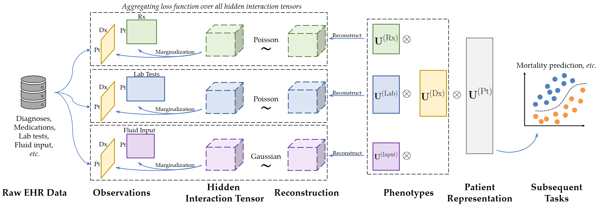

# Learning Inter-Modal Correspondence and Phenotypes from Multi-Modal Electronic Health Records (TKDE)

This repo contains the PyTorch implementation of the paper `Learning Inter-Modal Correspondence and Phenotypes from Multi-Modal Electronic Health Records` in TKDE. [[paper]](https://arxiv.org/pdf/2011.06301.pdf) [[publisher]](https://doi.org/10.1109/TKDE.2020.3038211)


<p align="center"></p>  

**Overview**: cHITF is a framework to jointly learn clinically meaningful phenotypes and hidden correspondence across different modalities from EHR data. Existing tensor factorization models mostly rely on the inter-modal correspondence to construct input tensors. In real-world datasets, the correspondence are often unknown and heuristics such as `equal-correspondence assumption` are commonly used, leading to inevitable errors. cHITF aims to *discover* such unknown inter-modal correspondence simultaneously with the phenotypes.

Check out [our paper](https://arxiv.org/pdf/2011.06301.pdf) for more details.

## Citation
If you find the paper or the implementation helpful, please cite the following paper:
```bib
@article{yin2020chitf,
    author = {Yin, Kejing and Cheung, William K. amd Fung, Benjamin C. M. and Poon, Jonathan},
    title = {Learning Inter-Modal Correspondence and Phenotypes from Multi-Modal Electronic Health Records},
    journal = "IEEE Transactions on Knowledge and Data Engineering (TKDE)",
    year = "in press",
}
```


## Requirements
The codes have been tested with the following packages:
- Python 3.7
- PyTorch 1.3
- openpyxl 3.0.5

## Quick Demo
To run the model with a quick demo data, clone the repo and run the following commands:
```bash
git clone git@github.com:jakeykj/cHITF.git
cd cHITF
python main.py
```
The results will be saved in the folder `./results/`.

Use `python main.py --help` to obtain more information about setting the parameters of the model.

## Specification of Hidden Interaction Tensors
The hidden interaction tensors can be specified using `-M` or `--modalities` argument. Each interaction tensor consists of two or more modalities which are joined with a hyphen `-`. Examples:
- `-M dx-rx` runs cHITF with one single hidden interaction tensor of diagnosis and medications.
- `-M dx-rx dx-lab` runs cHITF with two hidden interaction tensors: the first has diagnosis and medications and the second has diagnosis and lab tests.
- `-M dx-rx-lab` runs cHITF with one single 4D hidden interaction tensor with diagnosis, medications, and lab tests. Although this is supported, it is NOT recommended to use hidden interaction tensors with more than two modalities due to much more complex interactions between them. See the paper for more discussions.

The distribution of each hidden interaction tensor must also be specified by using the `-d` or `--distributions` argument. We support two distributions: Poisson (letter: P) and Gaussian/Normal (letter: G). To specify the distribution, feed the letters as the argument in the *same order* as the hidden interaction tensor  For example:
- `-M dx-rx -d P` specifies to use Poisson distribution for the hidden interaction tensor.
- `-M dx-rx dx-input -d P G` specifies Poisson and Gaussian distributions for the first and second interaction tensors, respectively.


## Data Format and Organization
The data are organized in a Python Dict object and are saved using the Python built-in `pickle` module. The input matrices and the feature index-to-description mappings are stored in the Dict object:
- **`dx`**: The `patient-by-diagnosis` binary matrix in form of `numpy.ndarray`.
- **`rx`**: The `patient-by-medication` counting matrix in form of `numpy.ndarray`.
- **`lab`**: The `patient-by-lab_test` counting matrix in form of `numpy.ndarray`.
- **`input`**: The `patient-by-input_fuild` real-number matrix in form of `numpy.ndarray`.
- **`dx_idx2desc`**, **`rx_idx2desc`**, **`lab_idx2desc`**, and **`input_idx2desc`**: Python Dict objects with the feature indices as keys and descriptions as values for modalities of diagnosis, medications, lab tests, and input fluids, respectively.

Note that matrices of all modalities must have the same size in their first dimensions.

The binary label of each patient is also one element of the Dict:
- **`mortality`**: A Python List object containing the binary mortality label of each patient. Must have the same size as the first dimension of all matrices as above.


If you use other datasets, you can organize the input data in the same format described above, and pass the `<DATA_PATH>` as a parameter to the training script:
```bash
python main.py --input <DATA_PATH>
```


## Contact
If you have any enquires, please contact Mr. Kejing Yin by email: 
`cskjyin [AT] comp [DOT] hkbu.edu.hk`. You are also very welcome to raise issues in this repository.

---
:point_right: Check out [my home page](https://kejing.me) for more research work by us.
